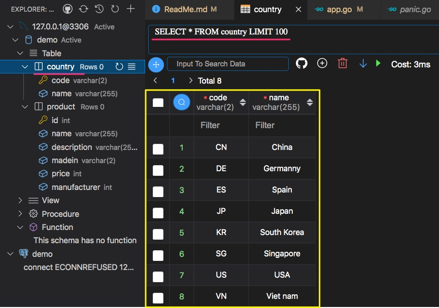

## Lab 1: Cài đặt Docker
Cài đặt Docker Desktop  [https://www.docker.com/products/docker-desktop](https://www.docker.com/products/docker-desktop)

## Lab 2: Tạo MySQL Docker Container
Chạy câu lệnh terminal này.
```
 docker run --name mydb -e MYSQL_ROOT_PASSWORD=abc123 -d mysql:latest
```

Giải thích:
* docker run` là lệnh khởi tạo một container từ docker image `mysql:latest`. Trong đó `mysql` là tên của docker image. Còn `:latest` là tên tag đánh dấu phiên bản, biến thể của docker image.
* `--name mydb`: đặt tên container
* `-e MYSQL_ROOT_PASSWORD=abc123`: đặt tham số password của tài khoản root trong mysql
* `-d`: chỉ định container chạy ở chế độ daemon (chế độ chạy background)


## Lab 3: Kết nối đến CSDL dữ liệu MySQL

Cài đặt Extension


## Lab 4: Kết nối đến MySQL container
```go
package main

import (
	"database/sql"
	"fmt"

	_ "github.com/go-sql-driver/mysql"
)

func main() {
	fmt.Println("Go MySQL Tutorial")

	//userid: demo
	//pass: toiyeuhanoi123-
	//database: demo
	db, err := sql.Open("mysql", "demo:toiyeuhanoi123-@tcp(127.0.0.1:3306)/demo")

	// if there is an error opening the connection, handle it
	if err != nil {
		panic(err.Error())
	}

	// defer the close till after the main function has finished
	// executing
	defer db.Close()

	// perform a db.Query insert
	insert, err := db.Query("INSERT INTO test VALUES ( 2, 'TEST' )")

	// if there is an error inserting, handle it
	if err != nil {
			panic(err.Error())
	}
	// be careful deferring Queries if you are using transactions
	defer insert.Close()
}
```

## Lab 5: Tạo bảng
```
Table product {
  id int [pk, increment]
  name varchar [not null]
  description varchar [not null]
  madein varchar(2) [ref: > country.code]
  price int
  manufacturer int [ref: > manufacturer.id]
}

Table country {
  code varchar(2) [pk, not null]
  name varchar [not null]
}
```

```sql
CREATE TABLE `product` (
  `id` int PRIMARY KEY AUTO_INCREMENT,
  `name` varchar(255) NOT NULL,
  `description` varchar(255) NOT NULL,
  `madein` varchar(2),
  `price` int,
  `manufacturer` int
);

CREATE TABLE `country` (
  `code` varchar(2) PRIMARY KEY NOT NULL,
  `name` varchar(255) NOT NULL
);

ALTER TABLE `product` ADD FOREIGN KEY (`madein`) REFERENCES `country` (`code`);
```

```go
func main() {
	fmt.Println("Go MySQL Tutorial")

	//userid: demo
	//pass: toiyeuhanoi123-
	//database: demo
	db, err := sql.Open("mysql", "demo:toiyeuhanoi123-@tcp(127.0.0.1:3306)/demo")

	// if there is an error opening the connection, handle it
	if err != nil {
		panic(err.Error())
	}

	// defer the close till after the main function has finished
	// executing
	defer db.Close()

	insert, err := db.Query("INSERT INTO country (code, name) VALUES ('VN', 'Viet nam')")
	insert, err = db.Query("INSERT INTO country (code, name) VALUES ('CN', 'China')")

	// if there is an error inserting, handle it
	if err != nil {
		panic(err.Error())
	}
	// be careful deferring Queries if you are using transactions
	defer insert.Close()
}
```

Kết quả
